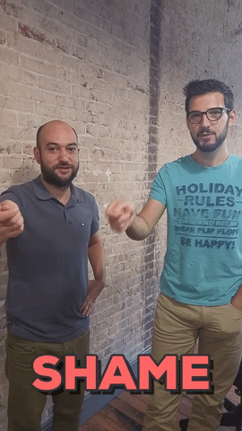

## {#slide-1 background-color="#0a0a0a"}

::: {.center-v}
### We're Zac & Pete — Development Seed

This is what we're seeing from inside our work.
:::

::: {.notes}
Zac. Quick hello, then hand off to Pete.
:::

## {#slide-2 background-color="#0a0a0a"}

::: {.center-v}
### Last year, we predicted more people would create software.

[Not just people with “software engineer” in their title.]{.detail}
[It wasn't that bold of a prediction.]{.detail .scribble}
:::

::: {.notes}
Pete. Connect this to last year's talk.
:::

## {#slide-3 background-color="#0a0a0a"}

::: {.center-v}
### The five stages of AI coding grief

::: {.grief-label-row}
::: {.grief-label-span}
[Last year]{.stage-year}
:::
::: {.grief-label-spacer}
:::
:::

::: {.grief-cycle}
::: {.grief-stage .current}
**Denial**

“It can't do real work.”
:::
::: {.grief-arrow}
→
:::
::: {.grief-stage .current}
**Anger**

“This isn't coding.”
:::
::: {.grief-arrow}
→
:::
::: {.grief-stage .current}
**Bargaining**

“Only for boilerplate.”
:::
::: {.grief-arrow}
→
:::
::: {.grief-stage .current}
**Despair**

“Well, this is awkward.”
:::
::: {.grief-arrow}
→
:::
::: {.grief-stage}
[This year]{.stage-year}

**Acceptance**

“This is how we build now.”
:::
:::

[Last year: grappling with the changes.]{.detail}
:::

::: {.notes}
Pete. Last year, our industry was cycling through the first four stages.
:::

## {#slide-4 background-color="#0a0a0a"}

::: {.center-v}
### The five stages of AI coding grief

::: {.grief-label-row}
::: {.grief-label-span}
[Last year]{.stage-year}
:::
::: {.grief-label-spacer}
:::
:::

::: {.grief-cycle}
::: {.grief-stage}
**Denial**

“It can't do real work.”
:::
::: {.grief-arrow}
→
:::
::: {.grief-stage}
**Anger**

“This isn't coding.”
:::
::: {.grief-arrow}
→
:::
::: {.grief-stage}
**Bargaining**

“Only for boilerplate.”
:::
::: {.grief-arrow}
→
:::
::: {.grief-stage}
**Despair**

“Well, this is awkward.”
:::
::: {.grief-arrow}
→
:::
::: {.grief-stage .current}
[This year]{.stage-year}

**Acceptance**

“This is how we build now.”
:::
:::

[This year: the question changed from “Will we?” to “How do we do it well?”]{.detail}
:::

::: {.notes}
Pete. This year, nearly everyone seems to have reached acceptance.
:::

## {#slide-5 background-color="#0a0a0a"}

::: {.center-v}
### What does acceptance look like?
:::

## {#slide-6 background-color="#0a0a0a"}

::: {.center-v}
### We receive vibe-coded projects.

[People aren't waiting for a software team to start building — and their projects work.]{.detail}
:::

## {#slide-7 background-color="#0a0a0a"}

::: {.center-v}
### We're working with teams who vibe-code.

[Our partners help create software with AI tools.]{.detail}
:::

## {#slide-8 background-color="#0a0a0a"}

::: {.center-v}
### We vibe-code.

{fig-alt="Shame"}

[We're always learning.]{.detail}
:::

## {#slide-9 background-color="#0a0a0a"}

::: {.center-v}
### Acceptance demands critical thinking.

["Vibe-coding" has many flavors.]{.detail}
:::

## {#slide-11 background-color="#0a0a0a"}

::: {.center-v}
{fig-alt="A dense network of interconnected people with several relationships highlighted" width=900}

### Without design and collaboration, products lack depth and texture

[Connections and iteration are needed to create excellence]{.orange}
:::

::: {.notes}
Zac. Name users, partners, organizations, and the people doing the work.
:::

## {#slide-12 background-color="#0a0a0a"}

::: {.center-v}
### When you can build anything, how do you decide what to build?

[Product questions should preceed develpoment]{.orange}
:::

## {#slide-13 background-color="#0a0a0a"}

::: {.center-v}
### The same pain points still exist

[Human-centric design still requires humans]{.orange}
:::

## {#slide-15 background-color="#0a0a0a"}

::: {.center-v}
### Once you decide what to build, how you build?
:::

::: {.notes}
Zac.
:::

## {#slide-10 background-color="#0a0a0a"}

::: {.center-v}
### Good vibe-coding is still software engineering

[Vibe-coded projects can be excellent software.]{.orange}

[Tests — CI/CD — Architectural patterns — Sharp, focused tools]{.detail}
:::

## {#slide-16 background-color="#0a0a0a"}

::: {.center-v}
### Mind the three filters

[True · Kind · Necessary]{.orange}

[Small PRs · Understand your contribution · Short feedback loops · Shared ownership]{.detail}
:::

::: {.notes}
Zac. Contrast this with receiving a wall of generated code.
:::

## {#slide-18 background-color="#0a0a0a"}

::: {.center-v}
### Maintenance still matters.

[It might look different, but you still gotta do it.]{.detail}
:::

## {#slide-19 background-color="#0a0a0a"}

::: {.center-v}
### Incentives for software collaboration are lower.

[When it's so easy to make your own thing, why would you help on an open-source project?]{.detail}
:::

## {#slide-23 background-color="#0a0a0a"}

::: {.center-v}
### Collaboration frameworks are changing?

[More room for design, more room for post-delivery documentation and engagement.]{.orange}
:::

::: {.notes}
Pete. Include domain experts among the possibilities. Keep this genuinely open.
:::

## {#slide-24 background-color="#0a0a0a"}

::: {.center-v}
### What will next year's presentation be about?

[How do we align incentives towards the three filters?]{.detail}

[True · Kind · Necessary]{.orange}
:::

## {#slide-applause background-color="#0a0a0a"}

::: {.center-v}
{fig-alt="Two stick figures with arms raised"}

<div class="clap-anim">👏</div>
:::

```{=html}
<script>
document.addEventListener('DOMContentLoaded', function () {
  // Give the title slide a clean URL hash (#/slide-title instead of #/title-slide)
  var ts = document.getElementById('title-slide');
  if (ts) ts.id = 'slide-title';

  // Countdown bar: sits above the RevealJS progress bar, runs right-to-left per slide
  var cdBar = document.createElement('div');
  cdBar.id = 'slide-countdown';
  cdBar.innerHTML = '<div id="slide-countdown-fill"></div>';
  document.querySelector('.reveal').appendChild(cdBar);

  function resetCountdown() {
    var fill = document.getElementById('slide-countdown-fill');
    fill.style.animation = 'none';
    fill.offsetHeight; // force reflow
    fill.style.animation = '';
  }

  Reveal.on('slidechanged', resetCountdown);
  Reveal.on('ready', resetCountdown);
});
</script>
```
