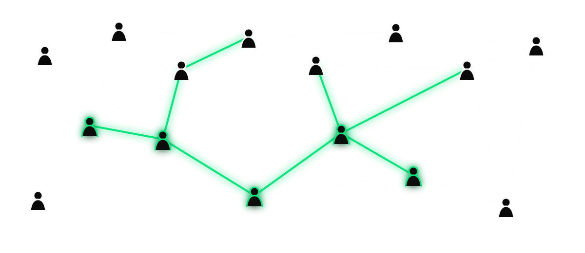
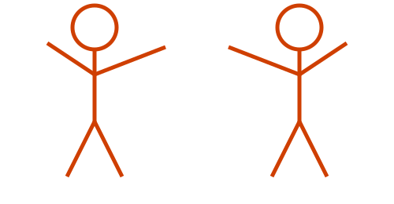

## {#slide-1 background-color="#0a0a0a"}

::: {.center-v}
### We're Zac & Pete — Development Seed

This is what we're seeing from inside the work.

[Last year, Pete asked where coding was headed.]{.detail}
:::

::: {.notes}
Zac. Quick hello, then hand off to Pete.
:::

## {#slide-2 background-color="#0a0a0a"}

::: {.center-v}
### Last year, Pete predicted more people would create software.

[Not just people with “software engineer” in their title.]{.detail}
:::

::: {.notes}
Pete. Connect this to last year's talk.
:::

## {#slide-3 background-color="#0a0a0a"}

::: {.center-v}
### This year, their projects are arriving at our door.

[People aren't waiting for a software team to start building—and their projects work.]{.detail}
:::

::: {.notes}
Pete.
:::

## {#slide-4 background-color="#0a0a0a"}

::: {.center-v}
### The five stages of AI coding grief

[Last year →]{.detail}

::: {.grief-cycle}
::: {.grief-stage}
**Denial**

“It can't do real work.”
:::
::: {.grief-arrow}
→
:::
::: {.grief-stage}
**Anger**

“This isn't coding.”
:::
::: {.grief-arrow}
→
:::
::: {.grief-stage}
**Bargaining**

“Only for boilerplate.”
:::
::: {.grief-arrow}
→
:::
::: {.grief-stage}
**Despair**

“Well, this is awkward.”
:::
::: {.grief-arrow}
→
:::
::: {.grief-stage .current}
[This year]{.stage-year}

**Acceptance**

“This is how we build now.”
:::
:::

[This year: the question changed from “Will we?” to “How do we do it well?”]{.detail}
:::

::: {.notes}
Pete. Last year, our industry was cycling through the first four stages. This year, nearly everyone seems to have reached acceptance.
:::

## {#slide-5 background-color="#0a0a0a"}

::: {.center-v}
### Until they need to survive.

[Another developer · Security · Operations · Life beyond the prompt]{.detail}
:::

::: {.notes}
Pete.
:::

## {#slide-6 background-color="#0a0a0a"}

::: {.center-v}
### AI reduced the cost of starting.

[Not the cost of understanding.]{.green}

[The work around implementation became easier to see.]{.detail}
:::

::: {.notes}
Pete. Hand off to Zac after this slide.
:::

## {#slide-7 background-color="#0a0a0a"}

::: {.center-v}
{fig-alt="A dense network of interconnected people with several relationships highlighted" width=900}

### Clarity lives in relationships.

[Context is not the same as nuance.]{.detail}
:::

::: {.notes}
Zac. Name users, partners, organizations, and the people doing the work.
:::

## {#slide-8 background-color="#0a0a0a"}

::: {.center-v}
### Before: what is actually worth building?

[Understand the real problem—not merely the first request.]{.detail}
:::

::: {.notes}
Zac.
:::

## {#slide-9 background-color="#0a0a0a"}

::: {.center-v}
### During: agree on how AI participates.

[What can it generate? What do people review? Where are decisions recorded?]{.detail}
:::

::: {.notes}
Zac. Treat the agent like a collaborator with explicit ground rules.
:::

## {#slide-10 background-color="#0a0a0a"}

::: {.center-v}
{fig-alt="Checklist icon" width=260}

### Tests are part of the prompt.

[Define what “correct” means from the beginning.]{.detail}
:::

::: {.notes}
Zac. Tests are not cleanup after generation.
:::

## {#slide-11 background-color="#0a0a0a"}

::: {.center-v}
### CI/CD · linting · security scanning

[Guardrails, not garnish.]{.green}

[Code can now arrive faster than people can understand it.]{.detail}
:::

::: {.notes}
Zac.
:::

## {#slide-12 background-color="#0a0a0a"}

::: {.center-v}
### Small iterations keep the work understandable.

[Small PRs · Short feedback loops · Shared ownership]{.detail}
:::

::: {.notes}
Zac. Contrast this with receiving a wall of generated code.
:::

## {#slide-13 background-color="#0a0a0a"}

::: {.center-v}
### After: the code keeps arriving.

[Contributions · Forks · Experiments · Feature requests]{.detail}
:::

::: {.notes}
Zac. Shipping is no longer the end.
:::

## {#slide-14 background-color="#0a0a0a"}

::: {.center-v}
### Maintainership is becoming curation.

[Shape an abundant stream of possible changes.]{.detail}
:::

::: {.notes}
Zac. Maintenance still matters; its center of gravity is shifting. Hand off to Pete.
:::

## {#slide-15 background-color="#0a0a0a"}

::: {.center-v}
### What belongs?

### What works?

### What lasts?

[Purpose · Trust · What the community can sustain]{.detail}
:::

::: {.notes}
Pete.
:::

## {#slide-16 background-color="#0a0a0a"}

::: {.center-v}
### An open-source project is not its repository.

[It is a community.]{.green}

[Users · Contributors · Institutions · Expectations · Disagreements]{.detail}
:::

::: {.notes}
Pete. The relationships are part of the project too.
:::

## {#slide-17 background-color="#0a0a0a"}

::: {.center-v}
### Community management does not automate away.

[Welcome · Explain · Resolve · Connect · Build trust]{.detail}
:::

::: {.notes}
Pete. Someone still has to do this work.
:::

## {#slide-18 background-color="#0a0a0a"}

::: {.center-v}
### But who plays the curator?

Maintainers? · Service companies? · Foundations?

AI agents? · The community itself?

[We don't know yet.]{.green}
:::

::: {.notes}
Pete. Include domain experts among the possibilities. Keep this genuinely open.
:::

## {#slide-19 background-color="#0a0a0a"}

::: {.center-v}
### Our wildest hope

More people create.

Communities shape what survives.

Curators make abundance useful.

[The goal is not simply more code.]{.detail}
:::

::: {.notes}
Pete. Emphasize participation, community agency, and durable infrastructure.
:::

## {#slide-20 background-color="#0a0a0a"}

::: {.center-v}
### AI can generate possibilities.

People still decide what becomes shared infrastructure.

[Attention · Judgment · Community]{.detail}

[Come find us.]{.green}
:::

::: {.notes}
Both. Ask the room who should play the curator. Thank you.
:::

## {#slide-applause background-color="#0a0a0a"}

::: {.center-v}
{fig-alt="Two stick figures with arms raised"}

<div class="clap-anim">👏</div>
:::

```{=html}
<script>
document.addEventListener('DOMContentLoaded', function () {
  // Give the title slide a clean URL hash (#/slide-title instead of #/title-slide)
  var ts = document.getElementById('title-slide');
  if (ts) ts.id = 'slide-title';

  // Countdown bar: sits above the RevealJS progress bar, runs right-to-left per slide
  var cdBar = document.createElement('div');
  cdBar.id = 'slide-countdown';
  cdBar.innerHTML = '<div id="slide-countdown-fill"></div>';
  document.querySelector('.reveal').appendChild(cdBar);

  function resetCountdown() {
    var fill = document.getElementById('slide-countdown-fill');
    fill.style.animation = 'none';
    fill.offsetHeight; // force reflow
    fill.style.animation = '';
  }

  Reveal.on('slidechanged', resetCountdown);
  Reveal.on('ready', resetCountdown);
});
</script>
```
